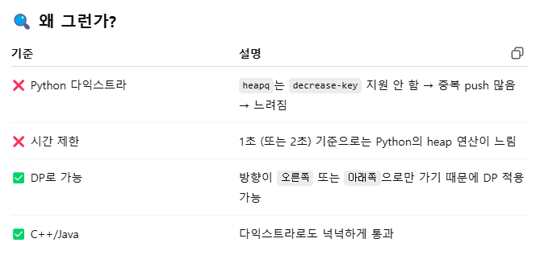

# 정리
## 1-1. 로직
- Python의 heapq는 logN의 시간 복잡도를 가지만 실제로는 더 느릴 수 있다 한다. 
    - 따라서 현재 문제는 사실 경로 탐색을 시뮬레이션으로 주고 다익스트라로 풀면 답은 나오지만 시간 초과가 발생한다.



- 따라서 현제 문제는 python으로 풀 경우 DP로 풀어야 한다.
    - Why?? 현제는 (우, 하)경로만 탐색하면 되기에 DP만 써도 충분하기 때문이다.

## 1-2. 시간 복잡도
- 실제로 내가 구한 시간 복잡도는 문제가 없다. 단, python heapq의 decrease-key로 인한 시간 복잡도를 고려하지 않았다.

```python
import sys, time
sys.stdin = open('input_11909.txt')
start_time = time.time()

#=================================================================
import heapq

# 델타 로직
dv = (1, 0)
dh = (0, 1)

# 다익스트라 구현 
def dijkstra():

    # 초기 값 설정
    v, h, cost = 0, 0, 0
    dist[0][0] = 0

    # heapq 구현
    queue = []
    heapq.heappush(queue, ((cost, v, h)))

    # 탐색 시작
    while queue:
        cost, v, h = heapq.heappop(queue)
        temp = 0

        # 만약 반환된 cost가 현재 cost보다 크다면 탐색할 필요 없음.
        if dist[v][h] < cost:
            continue 

        # 탐색
        # 우, 하만 보면 되는 경우
        if 0 <= v < N - 1 and 0 <= h < N - 1:
            
            for i in range(2):
                nv = v + dv[i]
                nh = h + dh[i]

                # 범위 넘어가면 skip
                if nv < 0 or nv >= N or nh < 0 or nh >= N:
                    continue
                
                # 이동하는 곳을 체크하며 cost를 더하면서 이동
                # 현제 값이 더 큰 경우 그냥 이동.
                if graph[v][h] > graph[nv][nh]:
                    
                    # 비용 초기화
                    temp = cost

                    # 비용이 큰 경우 skip
                    if dist[nv][nh] <= temp:
                        continue

                    # 아니면 탐색 추가
                    dist[nv][nh] = temp
                    heapq.heappush(queue, ((dist[nv][nh], nv, nh)))
                
                # 더 작은 칸이 없는 경우 cost 연산 해야함.
                if graph[v][h] <= graph[nv][nh]:
                    diff = 0
                    diff = graph[nv][nh] - graph[v][h] + 1

                    # 비용 초기화
                    temp = cost + diff
                    
                    # 비용이 큰 경우 skip
                    if dist[nv][nh] <= temp:
                        continue

                    # 아니면 탐색 추가.
                    dist[nv][nh] = temp
                    heapq.heappush(queue, ((dist[nv][nh], nv, nh)))
        
        # 우측만 이동하는 경우
        if v == N - 1:
            nv = v
            nh = h + 1

            # 범위 넘어가면 skip
            if nv < 0 or nv >= N or nh < 0 or nh >= N:
                continue
            
            # 이동하는 곳을 체크하며 cost를 더하면서 이동
            # 현제 값이 더 큰 경우 그냥 이동.
            if graph[v][h] > graph[nv][nh]:
                
                # 비용 초기화
                temp = cost

                # 비용이 큰 경우 skip
                if dist[nv][nh] <= temp:
                    continue

                # 아니면 탐색 추가
                dist[nv][nh] = temp
                heapq.heappush(queue, ((dist[nv][nh], nv, nh)))
            
            # 더 작은 칸이 없는 경우 cost 연산 해야함.
            if graph[v][h] <= graph[nv][nh]:
                diff = 0
                diff = graph[nv][nh] - graph[v][h] + 1

                # 비용 초기화
                temp = cost + diff
                
                # 비용이 큰 경우 skip
                if dist[nv][nh] <= temp:
                    continue

                # 아니면 탐색 추가.
                dist[nv][nh] = temp
                heapq.heappush(queue, ((dist[nv][nh], nv, nh)))

        # 아래만 이동
        if h == N - 1:
            nv = v + 1
            nh = h

            # 범위 넘어가면 skip
            if nv < 0 or nv >= N or nh < 0 or nh >= N:
                continue
            
            # 이동하는 곳을 체크하며 cost를 더하면서 이동
            # 현제 값이 더 큰 경우 그냥 이동.
            if graph[v][h] > graph[nv][nh]:
                
                # 비용 초기화
                temp = cost

                # 비용이 큰 경우 skip
                if dist[nv][nh] <= temp:
                    continue

                # 아니면 탐색 추가
                dist[nv][nh] = temp
                heapq.heappush(queue, ((dist[nv][nh], nv, nh)))
            
            # 더 작은 칸이 없는 경우 cost 연산 해야함.
            if graph[v][h] <= graph[nv][nh]:
                diff = 0
                diff = graph[nv][nh] - graph[v][h] + 1

                # 비용 초기화
                temp = cost + diff
                
                # 비용이 큰 경우 skip
                if dist[nv][nh] <= temp:
                    continue

                # 아니면 탐색 추가.
                dist[nv][nh] = temp
                heapq.heappush(queue, ((dist[nv][nh], nv, nh)))

    # 결과 반환
    return dist[N - 1][N - 1]

T = int(input())

for tc in range(1, T + 1):
    N = int(input())
    graph = [list(map(int, input().split())) for _ in range(N)]
    dist = [[int(1e9)] * N for _ in range(N)]

    ans = dijkstra()
    print(ans)
#=================================================================

end_time = time.time()
print('time :', end_time - start_time)

'''
< 로직 1 >
1. 그냥 이동 가능한 곳으로 모두 경로로 넣음.

2. 현재 셀보다 작은 곳이 없다면 비용을 추가하면서 이동할 곳이 생기면 이동.
    - 이게 다익스트라의 로직임.

3. 도착할 경우 비용 출력.
'''

'''
< 시간 복잡도 >
- O((2,222 * 2,222 + 4) * log(2,222 * 2,222))
'''

'''
< 문제 정리 >
1. N의 크기는 1이상 222이하.

2. 상수의 위치가 1, 1임.

3. 이동 로직
    3-1. 1 <= v, h < N: 우로 이동 or 아래로 이동.
    3-2. v == N and 1 <= h < N: 우로 이동.
    3-3. 1 <= v < N and h < N: 아래로만 이동
    3-4. v == h == N: 출구

4. 버튼 시뮬
    - 이동을 하려면 '현제 셀 > 이동할 셀' 조건을 만족해야 한다.
    -> 단, 현제 셀에 +1을 반복하여 이동할 셀의 값을 '초과'하면 이동이 된다.
    -> 이때 최소 추가 비용.
    -> dijkstra 
'''
```